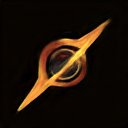
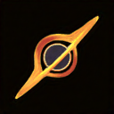
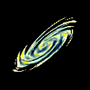
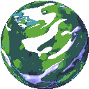
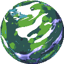
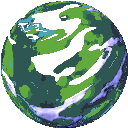

# GAN-space-objects

Генерация космических объектов с помощью генеративно-состязательных сетей (GAN)

Датасет собран через: https://deep-fold.itch.io/pixel-planet-generator

### DCGAN

### Self-Attention-GAN

### Sin-GAN
В отличие от классических GAN, Sin-GAN обучается на одном изображении и может использоваться для решения задач гармонизации, анимации, редактирования изображения. Более подробно тут https://arxiv.org/pdf/1905.01164. 

В данном примере модель использовалась для генерации gif анимации.

### StyleGAN
todo